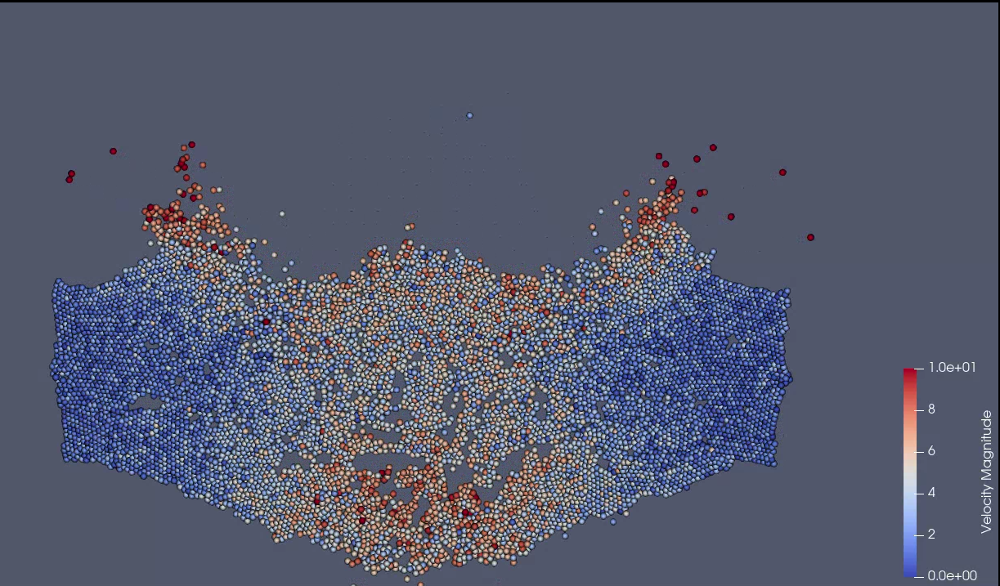

# Particle Dynamics Simulation Project in C++

## Authors
- Mohammed Reda Belfaida
- Mehdi El Oudghiri

## Project Overview



## Description
This project is a numerical simulator modeling particle dynamics in a discretized space. It integrates advanced features such as interparticle interactions, temporal integration of motion equations, and scientific visualization of results.

## Key Features
- **Spatial Modeling** : Universe partitioned into discrete cells.
- **Configurable Parameters** : Dimensions (1D, 2D, 3D), particle count, initial states, and time control.
- **Simulation Mechanisms** :
    - Interparticle interactions (Lennard-Jones forces, gravity).
    - Temporal integrators (Explicit/Implicit Euler, Størmer-Verlet).
    - Boundary conditions (reflection, absorption, periodic).
- **Scientific Visualization** : VTK file generation for ParaView.

## Project Structure  

```
.
├── build
├── cmake-build-debug
├── CMakeLists.txt
├── doc         // Documentation (Doxygen)
├── docs        // Includes main report and user guide
├── Doxyfile    
├── include
├── out         // Simulation results (VTK files)
├── README.md
├── src         // Contains  main source code
└── test        // Testing module
```


## Installation
1. **Prerequisites**:
    - C++ compiler (g++, clang)
    - CMake (optional for compilation)
    - Libraries :  Google Test (testing) 
    - Software Visualization : Paraview
   
2. **Compilation**:
   ```bash
   mkdir build && cd build
   cmake ..
   make
   ```

3. **Execution**:
    ```bash
   // for example
   ./mainLab4 
   ```

## Usage:

1. **Configuration** :
    - Modify parameters in the dedicated main scripts
    - Example :
    ```bash
    int main() {
    int dim = 2;
    double L2 = 40;
    double L1 = 250;

    double eps = 5.0;
    double sigma = 1.0;
    double rcut = 2.5 * sigma;

    std::vector<double> Ld = {L1, L2};

    Univers univers(dim, 0, rcut, Ld);

    initialiserSceneCollision(univers);

    double deltaTime = 0.005;
    int steps = static_cast<int>(15 / deltaTime);

    univers.applyStormerVerlet(deltaTime, steps, eps, sigma, "mainLab4");
    return 0;
    
   }
    ```

2. **Visualization** :
- Generated VTK files in one of **"out/" directory**  can be opened with ParaView.
- Example ParaView command:

```bash
paraview out/mainLab4/trajectory_*.vtu
```

## Results:

- **Performance** : Optimized via memory pre-allocation and parallelization (see report for benchmarks).

- **Validation** : Unit tests and comparison with theoretical solutions (planetary orbits, collisions).

## Documentation:

Generated with Doxygen :

```
doxygen docs/Doxyfile
```

Open **docs/html/index.html** for detailed documentation.

## References

- TP1 to TP6 reports included in docs/.

- Bibliography : Numerical methods (Euler, Størmer-Verlet), statistical physics.

## Additional Notes:

- For advanced usage, refer to dedicated sections in the report (optimizations, UML diagrams).

- Run unit tests via ctest after compilation.